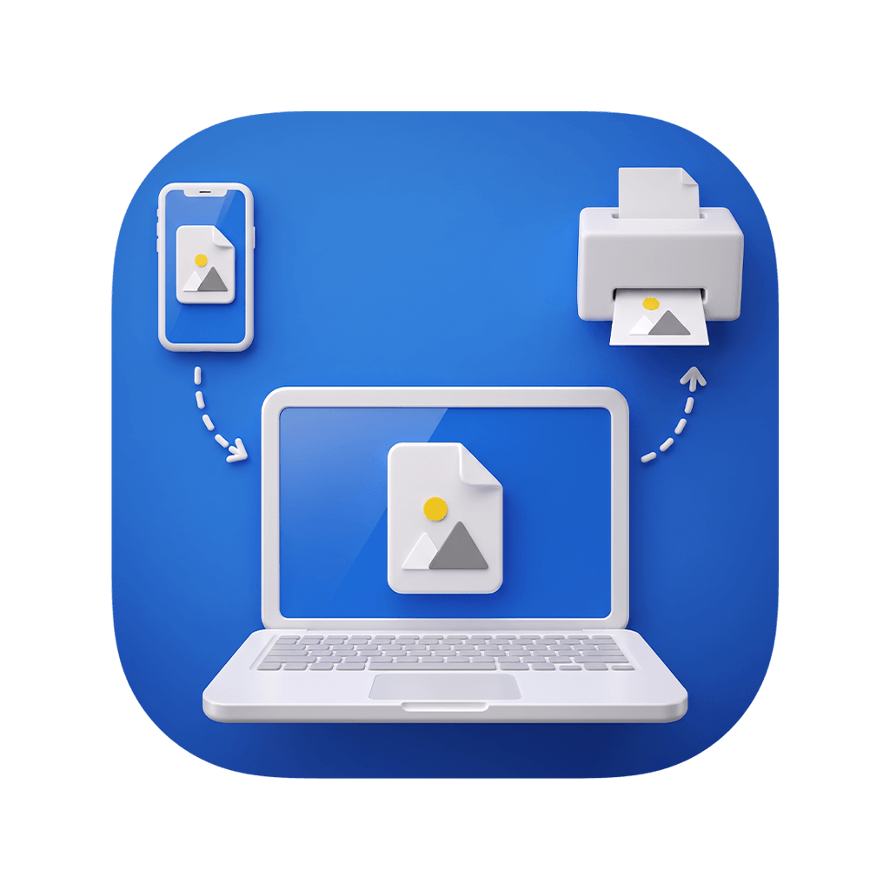
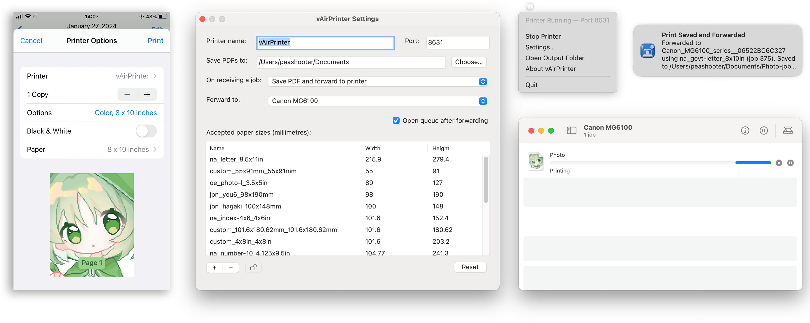

# vAirPrinter


A menu bar application that receives IPP print jobs through the system `ippeveprinter` service and saves those jobs as PDFs or forwards them to an installed printer.



# Troubleshooting

#### macOS Security & Quarantine

Some magic macOS commands you can see everywhere.

`sudo spctl --master-disable`

`xattr -r -d com.apple.quarantine /Applications/vAirPrinter.app`

#### Some Paper Sizes Are Not Shown

When too many paper sizes are configured, vAirPrinter omits some ready-tray entries because the maximum HTTP request length for `ippeveprinter` is 1024 bytes.

Additionally, Android does not respect the paper sizes reported by the printer, so they may not be displayed correctly.

## Build

```bash
xcode-select --install
make
```
